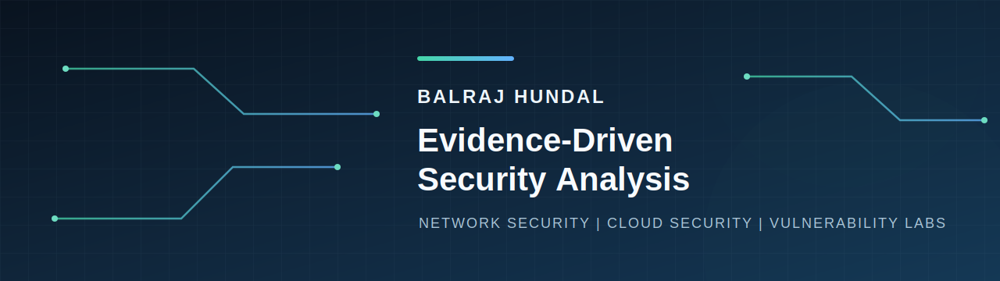

# Balraj Hundal

Cybersecurity post-graduate student at Douglas College focused on security
analysis that is clear, testable, and supported by evidence.

My strongest work so far sits at the intersection of network security, cloud
security, and vulnerability-focused lab analysis. I enjoy taking a messy
technical question, reducing it to what can actually be observed, and writing
the result so another analyst can follow the reasoning.

## Selected Work

### Evidence-Driven Network Security Investigations

[View the repository](https://github.com/Balraj7860/network-security-investigations)

Sanitized case studies built from authorized academic labs covering Splunk
telemetry validation, packet capture triage, Wireshark session analysis, and
NetworkMiner artifact review. Each report separates observations from
conclusions and documents limitations, confidence, and next validation steps.

### Cloud Application Security Assessment

[View the repository](https://github.com/Balraj7860/SpecialTopicInCyberSecurity_Project)

An in-progress assessment of a three-tier cloud application comparing an
intentionally insecure baseline with focused controls for identity, secrets
management, and network exposure.

### Python Security Lab

[Private due to Integrity Reasons]

A learning archive of Python work covering network discovery, subnet analysis,
hashing, encoding, encryption, and repeatable command-line workflows.

## Coursework Foundation

- Dean's List and Honour Roll standing in the Computer & Information Systems
  post-baccalaureate diploma
- Strong course results in Network CyberSecurity, Cloud CyberSecurity, Evidence
  Imaging, Special Topics in Emerging Tech, and Data Visualization
- Current semester: Vulnerabilities and Exploits, Special Topics in
  CyberSecurity, and Applied Research Project

## Tools I Can Back With Public Work

- Security analysis: Splunk, Wireshark, tcpdump, TShark, Dumpcap, NetworkMiner
- Cloud security: IAM, secrets management, network segmentation, exposure review
- Scripting and automation: Python, Bash, repeatable lab workflows
- Development context: Node.js, Express, React, Git

## How I Approach Security Work

- Start with a clear security question.
- Keep observations separate from conclusions.
- Document false positives, limitations, and next steps.
- Treat remediation as something to verify, not assume.

[LinkedIn](https://www.linkedin.com/in/balraj-singh-55974b3ab/) | [GitHub](https://github.com/Balraj7860)
